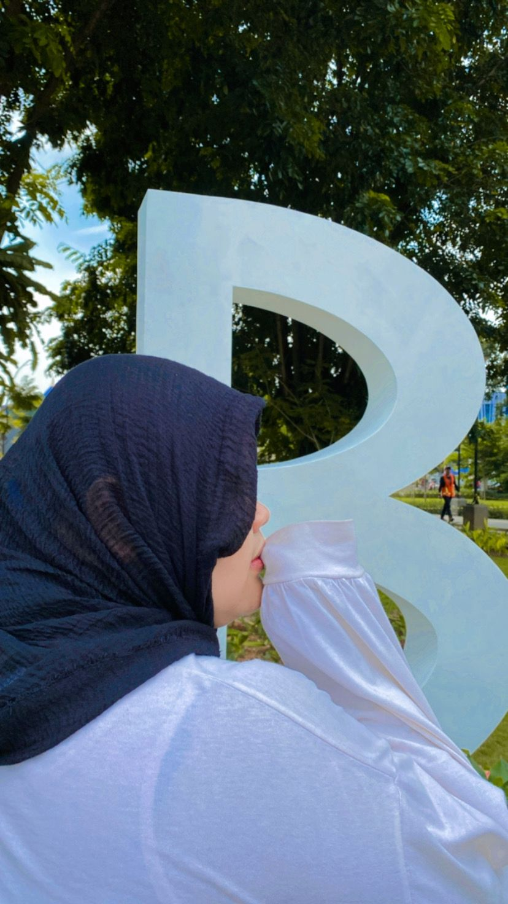

<!-- Profile Header -->

  

<h1 align="center">✨ Hello, I'm qieesaal ✨</h1>

  🌸 Web Design | 📱 App Design | 🤝 Conflict Mediation | 🎨 UI/UX  
  📚 E-learning | ✈️ Travelling Enthusiast

---

## 🌟 About Me  
I’m passionate about exploring new things in IT and design.  
I enjoy learning, sharing knowledge, and making friends from around the world.  
Always open for collaboration and new challenges 🚀.  

---

## 📊 GitHub Stats  

  

  

  

---

## 🚀 Social Media  

  
  
  
  

---

## ✨ Profile Visitors  

  

---

## 🎉 Fun Animation  

  

